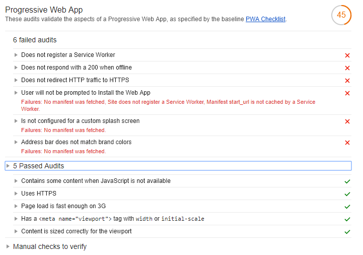
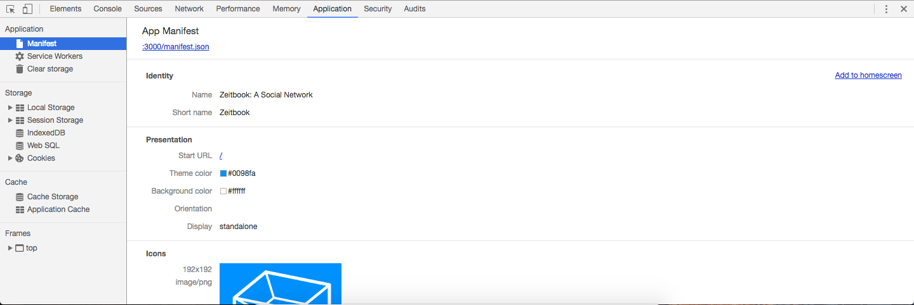

# Web app manifest

The web app manifest is a JSON file that contains important information about your application. If your application provides a manifest, browsers will prompt your users to install it to their devices' homescreens. You can also use the manifest to control whether your application is displayed in portrait or landscape, to choose a theme colour for the browser's UI, or even to hide the UI altogether.

## Run Lighthouse

Before adding a manifest to your application, let's run Lighthouse on it. Lighthouse is an automated tool for improving the quality of web pages. You can use it to test your application against [Google's Progressive Web App checklist](https://developers.google.com/web/progressive-web-apps/checklist).

To run Lighthouse against your application, open the Chrome DevTools and navigate to the Audits tab. On this page, you can run a Progressive Web App audit by clicking on "Perform an audit..." and checking the Progressive Web App checkbox.

Here are the results you should see:



## Manifest file

Open the file `assets/manifest.json` and replace the contents of the file with the code below:

```json
{
    "short_name": "Zeitbook",
    "name": "Zeitbook: A Social Network",
    "theme_color": "#0098fa",
    "background_color": "#0098fa",
    "start_url": "/",
    "display": "standalone"
}
```

> Your web app manifest now contains the following properties:
>
> | Key | Description |
> |-|-|
> | `short_name` | Display name of the application on mobile devices when added to the homescreen |
> | `name` | Name used by browsers when they prompt users to install your application |
> | `theme_color` | Colour of the toolbar when your application is running in a browser |
> | `background_color` | Colour of your application's splash screen, which is displayed after a user opens your application from their homescreen |
> | `start_url` | The page that is first loaded when a user opens your application from their homescreen |
> | `display` | Set this property to `"browser"` to display the browser's UI or to `"standalone"` to hide it |

## Create and reference icons

If you want browsers to prompt your users to install your application, you must list a set of icons in your manifest. First, move the directory `steps/icons` to `assets/icons`. Next, add the following key-value pair **below** `"display": "standalone"`:

```json
    "icons": [
        {
            "src": "/icons/192x192.png",
            "sizes": "192x192",
            "type": "image/png"
        },
        {
            "src": "/icons/256x256.png",
            "sizes": "256x256",
            "type": "image/png"
        },
        {
            "src": "/icons/512x512.png",
            "sizes": "512x512",
            "type": "image/png"
        }
    ]
```

Make sure to add a trailing comma to the line `"display": "standalone"`.

## Reference the manifest in your application's HTML files

Add the following line within the `<head>` tags of `assets/pages/index.html` and `assets/pages/post.html`:

```html
<link rel="manifest" href="/manifest.json">
```

## Test the manifest

Open your application at [localhost:3000](localhost:3000) using Google Chrome, then open Chrome DevTools (`F12` on Windows or `cmd + option + j` on macOS). In the Application tab of the DevTools, click on the Manifest menu item. You should see all the data from your application's manifest, including the icons that you just added:



## Run Lighthouse again

Try running the Lighthouse Progressive Web App audits again. You can run Lighthouse in Chrome DevTools under the Audits tab.

Your application should now pass seven of the thirteen PWA audits, up from four at the start of this step. In particular, since you've added a web app manifest to your application, it should pass the "Configured for a custom splash screen" check:


However, your application will not pass the "User will be prompted to Install the Web App" check, even though it has a manifest. This is because your application does not have a service worker, which you will add in the next step.

## Next step

[Add a service worker to your application.](./02-service-worker.md)
