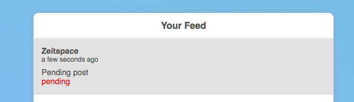
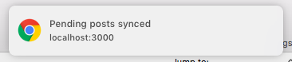

# Background Sync

Background Sync is an experimental web API that lets you schedule tasks to run when the user's device has a stable connection to the Internet. In this step, you'll use the API to allow users to create posts and comments while offline. You'll change your application to follow these steps when a user creates a new post or comment:

1. The main thread adds the post or comment to a queue and notifies the service worker
1. The service worker reads the post or comment from the queue
1. The service worker repeatedly tries to create the post or comment on the backend, sending a message to the main thread when it succeeds
1. The main thread updates the UI to indicate that the post or comment has been created on the backend

## Modify the `createPost` function to request a sync when a user creates a post

Replace the **body** of the `createPost` function in `src/api.js` with the following code:

```javascript
  const post = { username, title, body };
  return notificationToken.then((token) => {
    post.token = token;
    return addToQueue('postsQueue', post);
  }).then((id) => {
    post.id = id;
    return navigator.serviceWorker.getRegistration();
  }).then(reg => reg.sync.register('send-post-queue')).then(() => {
    const result = {
      id: `post-${post.id}`, time: new Date(), user: username, title, content: body, synced: false,
    };
    return buildPost({ withComments: false })(result);
  });
```

This code first creates a post object, then adds the user's notification token to it. Next, it calls the `addToQueue` function, which adds the post to a queue of posts that haven't been sent to the backend yet. This queue is stored in IndexedDB, a client-side database. `addToQueue` returns a temporary ID for the post, which is added to the post object.

After storing the new post in IndexedDB, the code requests a background sync by calling `reg.sync.register('send-post-queue')`. When this function is called, your application's service worker receives a `sync` event with the tag `send-post-queue`. In a little while, you'll change your service worker to respond to this event.

`createPost` returns a post object that will be used to display the user's new post. Note that the parameter `synced: false` is passed to `buildPost`. With this parameter, the post will be rendered to indicate that it hasn't been added to the backend database yet.

## Modify the `createComment` function to request a sync when a user creates a comment

Replace the **body** of the `createComment` function in `src/api.js` with the following code:

```javascript
  const comment = { username, body, postId };
  return notificationToken.then((token) => {
    comment.token = token;
    return addToQueue('commentsQueue', comment);
  }).then((id) => {
    comment.id = id;
    return navigator.serviceWorker.getRegistration();
  }).then(reg => reg.sync.register('send-comment-queue'))
    .then(() => {
      const result = {
        id: `comment-${comment.id}`, time: new Date(), user: username, comment: body, synced: false,
      };
      return buildComment(result);
    });
```

The code above is nearly identical to `createPost`, except that it adds the comment to a different queue in IndexedDB.

## Modify your service worker to listen for `sync` events

Add the following code to the **top** of `assets/service-worker.js`:

```javascript
importScripts('https://cdn.jsdelivr.net/npm/idb-keyval@2.3.0/idb-keyval.min.js');
importScripts('./scripts/util.js');
```

Next, add the following code to the **bottom** of `assets/service-worker.js`:

```javascript
self.addEventListener('sync', (event) => {
  if (event.tag === 'send-post-queue') {
    event.waitUntil(sendPosts());
  } else if (event.tag === 'send-comment-queue') {
    event.waitUntil(sendComments());
  }
});
```

You'll define `sendPosts` and `sendComments` next.

## Modify your service worker to send posts and comments to the backend

Add the following code to `assets/service-worker.js`, just **above** the `sync` event listener that you just added:

```javascript
const API_ROOT = 'https://zeitbook.herokuapp.com';

function sendPosts() {
  return getQueue('postsQueue').then((postsQueue) => {
    let postsList = postsQueue;
    return Promise.all(postsQueue.map(post => fetch(`${API_ROOT}/posts`, {
      method: 'post',
      headers: {
        'Content-type': 'application/x-www-form-urlencoded; charset=UTF-8',
      },
      body: `user=${post.username}&title=${post.title}&content=${post.body}&token=${post.token}`,
    }).then(json)
      .then(response => sendMessageToAllClients({ type: 'post-update', id: post.id, post: response }))
      .then(() => {
        postsList = postsList.filter(p => p.id !== post.id);
        return updateQueue('postsQueue', postsList);
      })));
  }).then(() => sendNotification('Pending posts synced'));
}

function sendComments() {
  return getQueue('commentsQueue').then((commentsQueue) => {
    let commentsList = commentsQueue;
    return Promise.all(commentsQueue.map(comment => fetch(`${API_ROOT}/posts/${comment.postId}/comment`, {
      method: 'post',
      headers: {
        'Content-type': 'application/x-www-form-urlencoded; charset=UTF-8',
      },
      body: `user=${comment.username}&comment=${comment.body}&token=${comment.token}`,
    }).then(json)
      .then(response => sendMessageToAllClients({ type: 'comment-update', id: comment.id, comment: response }))
      .then(() => {
        commentsList = commentsList.filter(c => c.id !== comment.id);
        return updateQueue('commentsQueue', commentsList);
      })));
  }).then(() => sendNotification('Pending comments synced'));
}
```

After receiving a `sync` event with the tag `send-post-queue` or `send-comment-queue`, the service worker will call `sendPosts` or `sendComments` respectively. These functions read the queues of posts and comments stored in IndexedDB and make POST requests to the backend for each post and comment to be created.

After each POST request completes successfully, the code sends a message to each of the service worker's clients, which are the open web pages that have registered that service worker. The message contains the updated post or comment (which contains its permanent ID) as well as the post or comment's temporary ID. In a little while, you'll modify your application to update the UI in response to these messages.

After sending a message for the post or comment, the code removes the created item from the correct queue in IndexedDB, so that the item won't be sent to the backend again when the next `sync` event is sent. Finally, once all of the posts or comments have been succesfully synced, a notification is shown to the user. (This notification will only appear when your application is in the background, i.e. when Chrome isn't the focused window or your application isn't the focused tab.)

## Listen for a message from the service worker when it creates a post

On line 47 of `src/index.js`, change `linkToComments: true` to `linkToComments: false`. This will cause pending posts to be rendered without a link to a comments page. This is necessary because the pending post isn't stored in the backend's database, so API requests for the post will fail.

Next, add the following code to the **bottom** of `src/index.js`:

```javascript
navigator.serviceWorker.addEventListener('message', (event) => {
  if (event.data.type === 'post-update') {
    const postDiv = $(`#post-${event.data.id}`);
    const postData = (({
      content, user, token, id, numComments, title,
    }) => ({
      body: content, username: user, token, time: new Date(), id, numComments, title,
    }))(event.data.post);
    postDiv.replaceWith(buildPostElement(postData, { linkToComments: true }));
  }
});
```

After receiving a message of type `post-update` from the service worker, this event listener updates the UI to reflect the fact that the pending post has been synced to the backend.

## Listen for a message from the service worker when it creates a comment

Add the following code to the **bottom** of `src/post.js`:

```javascript
navigator.serviceWorker.addEventListener('message', (event) => {
  if (event.data.type === 'comment-update') {
    const commentData = (({
      comment, user, token, id,
    }) => ({
      body: comment, username: user, token, time: new Date(), id,
    }))(event.data.comment);
    const commentDiv = $(`#comment-${event.data.id}`);
    commentDiv.replaceWith(buildCommentElement(commentData));
  }
});
```

This code is identical to the code you just added to `src/index.js`, except that it listens for events of type `comment-update`.

## Test that Background Sync works



You can test out Background Sync by disconnecting from the Internet, then creating a post or a comment. You should see a pending post added to the top of the list of posts. When you reconnect to the Internet, you should see the "pending" text removed from your post.



You can test that a notification is sent by changing tabs, then reconnecting to the Internet.
